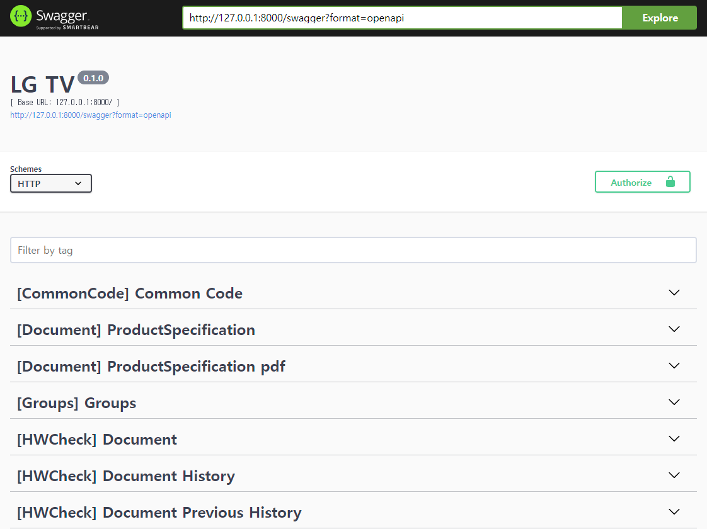

# 실행

## 실행 환경

- python version : 3.10.6

## Backend

- Backend 프로젝트 디렉토리 진입

```
cd HeavenBackend
```

### 가상 환경 세팅

#### 가상환경

- 가상 환경 생성 및 진입
  ```
  python -m venv ./venv
  source ./venv/bin/activate
  ```
- 패키지 설치
  ```
  pip install --upgrade pip
  pip install -r ./requirments.txt
  ```

### Backend 실행

```
# 가상환경 진입 후
daphne heaven.asgi:application
```

## Client

- Client 프로젝트 디렉토리 진입

```
cd heaven-ws-client
```

### 가상 환경 세팅

#### 가상환경

- 가상 환경 생성 및 진입
  ```
  python -m venv ./venv
  source ./venv/bin/activate
  ```
- 패키지 설치
  ```
  pip install --upgrade pip
  pip install -r ./requirments.txt
  ```

### client 실행

- heaven-ws-client/config/config.ini 파일의 url을 Backend IP로 수정
  - localhost인 경우, 127.0.0.1로 작성해야 함
  ```ini
  [websocket]
  url = ws://127.0.0.1:8000/webapp/
  ```

```
# 가상환경 진입 후
python main.py
```

# Websocket Message Data Structure

## 기본 포맷

```
{
  "data_type": "result",      # 데이터의 종류
  "device_ip": "127.0.1.1",   # client(Test PC)의 IP
  "test_id": "test_1",        # unique한 test ID
  "data": {},                 # 전달 데이터 내용(data_type에 따라 포맷이 다름)
  "dt": "2023/08/18 01:24:20" # 데이터 전송 시간
}
```

### 기본 포맷 상세

- data_type
  - data_type은 아래 3종류가 존재
    - "command"
      - Backend에서 Client로 전송되며 client에 명령을 전달하는 역할
    - "result"
      - Client에서 Backend로 전송되며 test 결과를 전달하는 역할
    - "status"
      - Client에서 Backend로 전송되며 test 상태를 전달하는 역할
- device_ip
  - client의 IP
- test_id
  - test를 구분하는데 사용되며, test별로 unique해야 함
- data
  - 상세 데이터
  - data_type이 "command"인 경우
    - 명령에 대한 파라미터를 전달
  - data_type이 "result"인 경우
    - test 결과를 건 별로 전달
  - data_type이 "status"인 경우
    - test process의 상태를 전달
- dt
  - 해당 Message를 전달하는 시간 (TimeZone은 UTC로 사용하고 있음)

## data_type별 data 필드 포맷

### "command"

```
"data": {
          "automation_type": "AC",          # 자동화 선택  AC | DC
          "judge_image": True,              # image 판정 여부 True | False
          "judge_cmd": True,                # command 판정 여부 True | False
          "judge_image_opt_set": {          # image 판정 옵션
              "opt1": {                     # image 판정 옵션1
                "opt_name": "opt1",         # 옵션1 이름
                "opt_value": "opt1_value"   # 옵션1 값
              },
              "opt2": {                     # image 판정 옵션2
                "opt_name": "opt2",
                "opt_value": "opt2_value"
              },
              "opt3": {                     # image 판정 옵션3
                "opt_name": "opt3",
                "opt_value": "opt3_value"
              },
          },
          "judge_cmd_opt_set": {            # command 판정 옵션
              "opt1": {                     # command 판정 옵션1
                "opt_name": "opt1",         # 옵션1 이름
                "opt_value": "opt1_value"   # 옵션1 값
              },
              "opt2": {                     # command 판정 옵션2
                "opt_name": "opt2",
                "opt_value": "opt2_value"
              },
              "opt3": {                     # command 판정 옵션3
                "opt_name": "opt3",
                "opt_value": "opt3_value"
              },
          },
          "cmd": "start",                   # 명령 종류 "start" | "stop" | "pause" | "resume"
      }
```

### "result"

```
"data": {
          "test_no": 80,            # test 번호
          "result": "ok",           # test 결과
          "judge_image_opt_set": {  # image 판정 test 결과
            "opt1": {               # image 판정 옵션1의 결과
              "opt_name": "opt1",   # 옵션1 이름
              "opt_value": "0.1",   # 옵션1 값
              "opt_result": "ok"    # 옵션1 결과 "ok" | "ng"
            },
            "opt2": {               # image 판정 옵션2의 결과
              "opt_name": "opt2",
              "opt_value": "0.1",
              "opt_result": "ok"
            },
            "opt3": {               # image 판정 옵션3의 결과
              "opt_name": "opt3",
              "opt_value": "0.1",
              "opt_result": "ok"
            }
          },
          "judge_cmd_opt_set": {    # command 판정 test 결과
            "opt1": {               # command 판정 옵션1의 결과
              "opt_name": "opt1",   # 옵션1 이름
              "opt_value": "0.1",   # 옵션1 값
              "opt_result": "ok"    # 옵션1 결과 "ok" | "ng"
            },
            "opt2": {               # command 판정 옵션2의 결과
              "opt_name": "opt2",
              "opt_value": "0.1",
              "opt_result": "ok"
            },
            "opt3": {               # command 판정 옵션3의 결과
              "opt_name": "opt3",
              "opt_value": "0.1",
              "opt_result": "ok"
            }
          },
          "source_img_path": "path/img_80.png" # 테스트 이미지의 NAS 서버 http URL
        },
```

### "status"

```
"data": {
          "status": "start" # test process의 실행 상태 "start" | "stop" | "pause" | "resume"
        }
```

# 테스트 방법

1. [Backend 실행](###-Backend-실행)
2. [Client 실행](###-client-실행)
3. API 호출
   - swagger 사용
     - Backend 서버 주소로 swagger 페이지 접속
       - http://127.0.0.1:8000/swagger
       - 주의 : localhost로는 접속이 되지 않으므로, 127.0.0.1 사용
       - 
     - test 시작
       - cmd-start API 호출
         
         1. Try it out 버튼 클릭
            
         2. "device_ip" 필드의 값을 client의 ip로 변경 및 "data" 필드의 옵션을 수정 후 Excute 버튼 클릭
         3. Backend와 Client를 실행한 터미널에서 결과 확인
     - test 일시정지
       - cmd-pause API 호출
         
         1. Try it out 버튼 클릭
            
         2. "device_ip" 필드의 값을 client의 ip로 변경 후 Excute 버튼 클릭
         3. Backend와 Client를 실행한 터미널에서 결과 확인
     - test 재개
       - cmd-resume API 호출
         
         1. Try it out 버튼 클릭
            
         2. "device_ip" 필드의 값을 client의 ip로 변경 후 Excute 버튼 클릭
         3. Backend와 Client를 실행한 터미널에서 결과 확인
     - test 중지
       - cmd-stop API 호출
         
         1. Try it out 버튼 클릭
            
         2. "device_ip" 필드의 값을 client의 ip로 변경 후 Excute 버튼 클릭
         3. Backend와 Client를 실행한 터미널에서 결과 확인
   - curl 사용
     - test 시작
       1. 아래 명령어의 "device_ip"를 client IP로 변경 및 "data" 필드의 옵션 값을 변겅 후, 터미널에서 실행 (마지막 줄의 http://127.0.0.1:8000/api/v1/webapp/cmd-start 구문은 Backend IP로 변경)
          ```
          curl -X POST -H "Content-Type: application/json" \
              -d '{
            "device_ip": "127.0.1.1",
            "test_id": "test_1",
            "data": {
              "automation_type": "AC",
              "judge_image": true,
              "judge_cmd": true,
              "judge_image_opt_set": {
                "opt1": {
                  "opt_name": "opt1",
                  "opt_value": "opt1_value"
                },
                "opt2": {
                  "opt_name": "opt2",
                  "opt_value": "opt2_value"
                },
                "opt3": {
                  "opt_name": "opt3",
                  "opt_value": "opt3_value"
                }
              },
              "judge_cmd_opt_set": {
                "opt1": {
                  "opt_name": "opt1",
                  "opt_value": "opt1_value"
                },
                "opt2": {
                  "opt_name": "opt2",
                  "opt_value": "opt2_value"
                },
                "opt3": {
                  "opt_name": "opt3",
                  "opt_value": "opt3_value"
                }
              }
            }
          }' \
          http://127.0.0.1:8000/api/v1/webapp/cmd-start
          ```
       2. Backend와 Client를 실행한 터미널에서 결과 확인
     - test 일시정지
       1. 아래 명령어의 "device_ip"를 client IP로 변경 후, 터미널에서 실행 (마지막 줄의 http://127.0.0.1:8000/api/v1/webapp/cmd-pause 구문은 Backend IP로 변경)
          ```
          curl -X POST -H "Content-Type: application/json" \
              -d '{
            "device_ip": "127.0.1.1",
            "test_id": "test_1"
          }' \
          http://127.0.0.1:8000/api/v1/webapp/cmd-pause
          ```
       2. Backend와 Client를 실행한 터미널에서 결과 확인
     - test 재개
       1. 아래 명령어의 "device_ip"를 client IP로 변경 후, 터미널에서 실행 (마지막 줄의 http://127.0.0.1:8000/api/v1/webapp/cmd-resume 구문은 Backend IP로 변경)
          ```
          curl -X POST -H "Content-Type: application/json" \
              -d '{
            "device_ip": "127.0.1.1",
            "test_id": "test_1"
          }' \
          http://127.0.0.1:8000/api/v1/webapp/cmd-resume
          ```
       2. Backend와 Client를 실행한 터미널에서 결과 확인
     - test 중지
       1. 아래 명령어의 "device_ip"를 client IP로 변경 후, 터미널에서 실행 (마지막 줄의 http://127.0.0.1:8000/api/v1/webapp/cmd-stop 구문은 Backend IP로 변경)
          ```
          curl -X POST -H "Content-Type: application/json" \
              -d '{
            "device_ip": "127.0.1.1",
            "test_id": "test_1"
          }' \
          http://127.0.0.1:8000/api/v1/webapp/cmd-stop
          ```
       2. Backend와 Client를 실행한 터미널에서 결과 확인

# Client와 Test 모듈 연동

- heaven-ws-client/modules/tester_controller.py 파일의 task_test 함수에 test 모듈 실행 코드 삽입

  ```python
  async def task_test(ws, args: WsDataStruct):
    global process_list

    await send_status_data(ws, args.device_ip, args.test_id, StatusEnum.START)

    i = 0

    while i < 100:
        # 테스트 소스 이미지의 NAS http url
        source_img_path = f"path/img_{i}.png"
        # image 판정 결과
        result_judge_image = ResultOptSet(
            # ResultOpt({옵션 이름}, {옵션 값}, {테스트 결과})
            ResultOpt("opt1", "0.1", ResultEnum.OK.value),
            ResultOpt("opt2", "0.1", ResultEnum.OK.value),
            ResultOpt("opt3", "0.1", ResultEnum.OK.value),
        )
        # command 판정 결과
        result_judge_cmd = ResultOptSet(
            # ResultOpt({옵션 이름}, {옵션 값}, {테스트 결과})
            ResultOpt("opt1", "0.1", ResultEnum.OK.value),
            ResultOpt("opt2", "0.1", ResultEnum.OK.value),
            ResultOpt("opt3", "0.1", ResultEnum.OK.value),
        )
        # 테스트 결과를 웹소켓을 사용하여 Backend로 전달
        await send_result_data(
            ws,                   # websocket
            args,                 # Backend에서 전송 받은 실행 데이터
            i,                    # test_no
            ResultEnum.OK,        # test 결과
            result_judge_image,   # image 판정 결과
            result_judge_cmd,     # command 판정 결과
            source_img_path,      # 소스 이미지 url
        )
        i += 1
        sleep(0.5)

    # 웹소켓을 사용하여 Backend로 finish status 메세지 전달
    await send_status_data(ws, args.device_ip, args.test_id, StatusEnum.FINISH)
    process_dict.pop(args.test_id)
  ```
